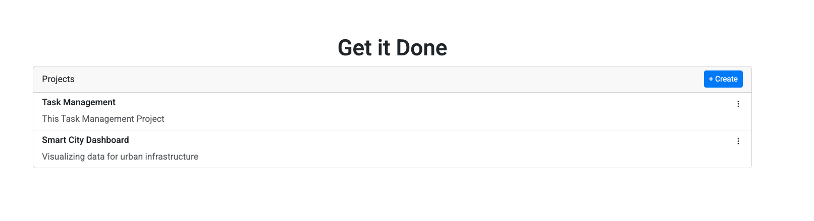
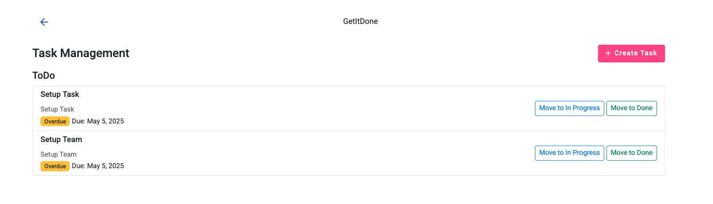
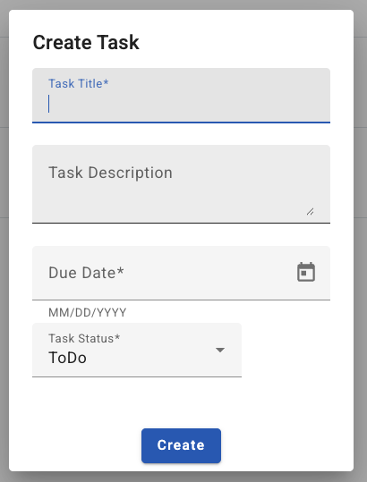
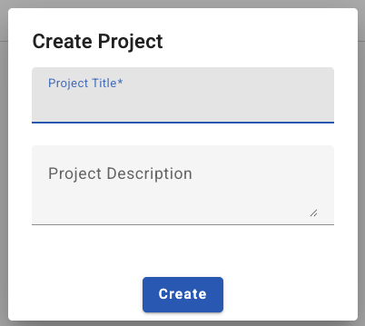

# GetItDone - Task Management App

A simple full-stack task management application with Angular and .NET 8.

## 🛠 Setup Instructions

### Clone the Repository
```bash
git clone https://github.com/habibiyusrizal-sys/getitdone-app.git
```
### Install Prerequisites
1. .NET 8.0.4 SDK
2. EF Core CLI Tools
```bash
dotnet tool install --global dotnet-ef --version 8.0.4

cd getitdone
cd API
dotnet ef database update
dotnet run

Note: By Default, the API run on https://localhost:5001
```
3. Install Node.js v20.19.0
4. Install Angular CLI globally
```bash
npm install -g @angular/cli@17

cd ClientApp
npm install
ng serve

Note: By default, the frontend runs on the http://localhost:42000

```
### Backend Test
```bash
cd API.Tests
dotnet test
```
## ✅ Feature List

- 🔍 View all projects and their associated tasks
- ➕ Create new project, add new task
- 🗂 Group tasks by status (To Do, In Progress, Done)
- 📆 Highlight overdue tasks
- ↔️ Navigate between Project and Task views
- 📱 Responsive design using Angular Material & Bootstrap

---

## 🧠 Assumptions Made

- Each task is required to be linked to a project via `projectId`.
- `taskDueDate` is optional, but when provided, it's used to highlight overdue tasks.
- `taskStatus` is submitted as a string and mapped to an Enum in the backend.

## 📸 Screenshots



### ➕ Create Task and Project




## 👨‍💼 Author
Habibi – Software Engineer


